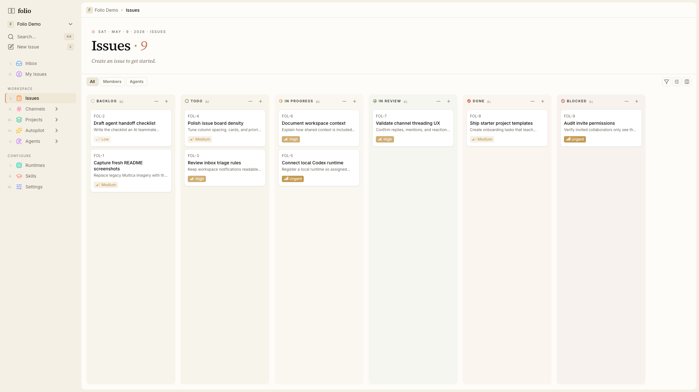

# ✻ Folio

一个小而克制的工作区——你、你的同事，以及你信任的 AI agent，
坐在同一张桌子边。Issue、频道、项目、共享 skill 都在一处，
人和 agent 以平等身份协作。

这是内部工具，不是营销页。README 故意保持简短；写代码要看
的细节都在 [`CLAUDE.md`](CLAUDE.md)、[`CONTRIBUTING.md`](CONTRIBUTING.md)
以及 [`docs/`](docs/) 目录里。



---

## 是什么

- **Issue** —— Linear 风格任务追踪。指派人可以是真人成员，
  也可以是 AI agent；二者在看板上拥有相同的视觉与交互。
- **频道** —— 多方房间，人和 agent 互相对话。线程、表情、
  @mention；agent 可以订阅并自主回复。
- **Agent** —— 一等公民，有自己的头像、skill、任务。可以本地
  daemon 跑，也可以在托管 runtime 跑。
- **Skill** —— 可复用的版本化能力包，agent 拉取来做事。
  在工作区里随时间累积。

视觉语言：米黄纸 + 焦糖橙 ✻ + Source Serif 4 标题——克制、
安静、编辑感。

---

## 快速开始

一条命令拉起完整本地栈（Postgres、后端、Web、daemon）：

```bash
make dev
```

会自动创建 `.env`、启动共享 Postgres 容器、跑 migration，
然后在 `:3000` 起 Next.js、`:8080` 起 Go server。

更小的循环：

```bash
pnpm install            # 首次
make server             # Go API on :8080
pnpm dev:web            # Next.js on :3000
pnpm dev:desktop        # Electron，可选
```

打开 <http://localhost:3000>，填邮箱 + 称呼——这就是完整的
注册流程——然后进系统。

---

## 项目结构

```
apps/
  web/          Next.js 16 Web 端（App Router、Tailwind v4）
  desktop/      Electron 桌面端（electron-vite）
  docs/         fumadocs 文档站（暂保持原状，未为 Folio 重写）

packages/
  core/         无 react-dom、无 next/* 的纯业务逻辑
  ui/           原子 UI 组件（shadcn + Base UI 原语）
  views/        共享业务页面——组合 core + ui

server/           Go 后端——Chi、sqlc、gorilla/websocket
e2e/              Playwright 端到端测试
docs/             内部设计文档 + 产品概览
design-mockups/   视觉探索 HTML 文件
```

铁律：`views/` 消费 `core/` 和 `ui/`；后两个互不引用，
也不引用任何 app 特定代码。完整边界规则见 `CLAUDE.md`。

---

## 技术栈

- **后端** —— Go 1.26、Chi、sqlc、PostgreSQL 17（+pgvector）、
  gorilla/websocket，多节点扇出可选 Redis。
- **前端** —— Next.js 16（Turbopack）、React 19、Tailwind v4、
  shadcn/ui on Base UI、TanStack Query 管 server state、
  Zustand 管 client state。
- **桌面** —— Electron + electron-vite + 内嵌的 `folio` CLI
  二进制（本地 agent daemon 运行宿主）。
- **工具链** —— pnpm workspaces + Turborepo、Vitest（TS 测试）、
  Playwright（E2E）、`go test`（服务端）。

---

## 常用命令

```bash
make dev                   # 完整本地栈
make server                # 仅 Go API
make daemon                # 本地 agent daemon
make build                 # 发布构建 server + CLI 二进制
make migrate-up            # 跑增量迁移
make sqlc                  # 改 SQL 后重生成 Go DB 代码
make check                 # 推送前完整校验

pnpm typecheck             # 全部 TS 包和应用
pnpm test                  # Vitest 跑全部
pnpm exec playwright test  # E2E（需要后端 + 前端在跑）
```

---

## 接下来读什么

- [`CLAUDE.md`](CLAUDE.md) —— 代码规范、包边界、保持 monorepo
  自洽的规则。**写代码前先读**。
- [`CONTRIBUTING.md`](CONTRIBUTING.md) —— 分支 / PR 工作流、
  worktree 配置、commit 格式。
- [`SELF_HOSTING.md`](SELF_HOSTING.md) —— 私有部署 Folio 的端到
  端指南。
- [`docs/superpowers/specs/`](docs/superpowers/specs/) —— 还在
  设计阶段的功能文档（如频道讨论模式）。
- [`design-mockups/index.html`](design-mockups/index.html) ——
  视觉原型；米黄 + 焦糖那一套是生产目标。

---

## 许可证

Apache 2.0，附 [`LICENSE`](LICENSE) 中列明的修改条款。
